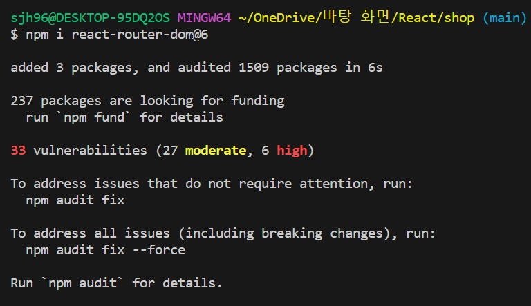
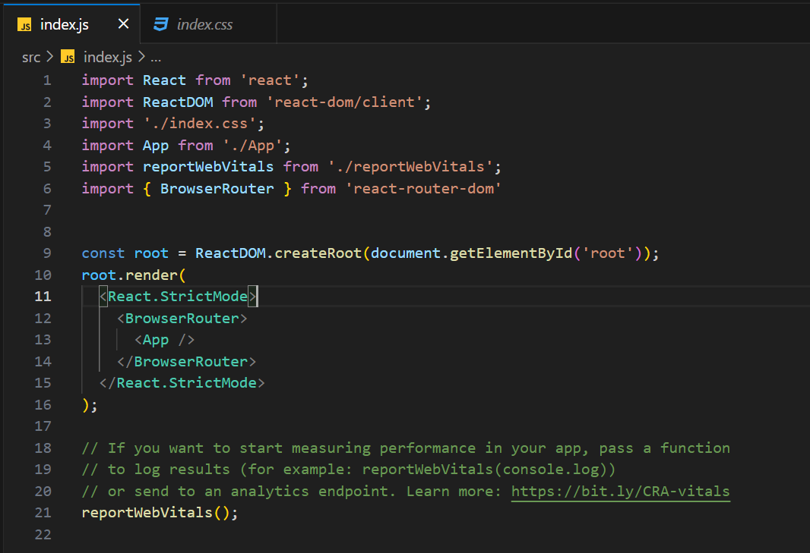
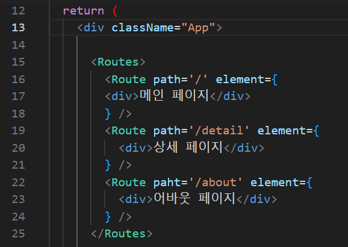
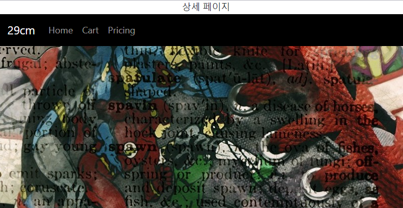
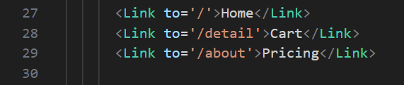
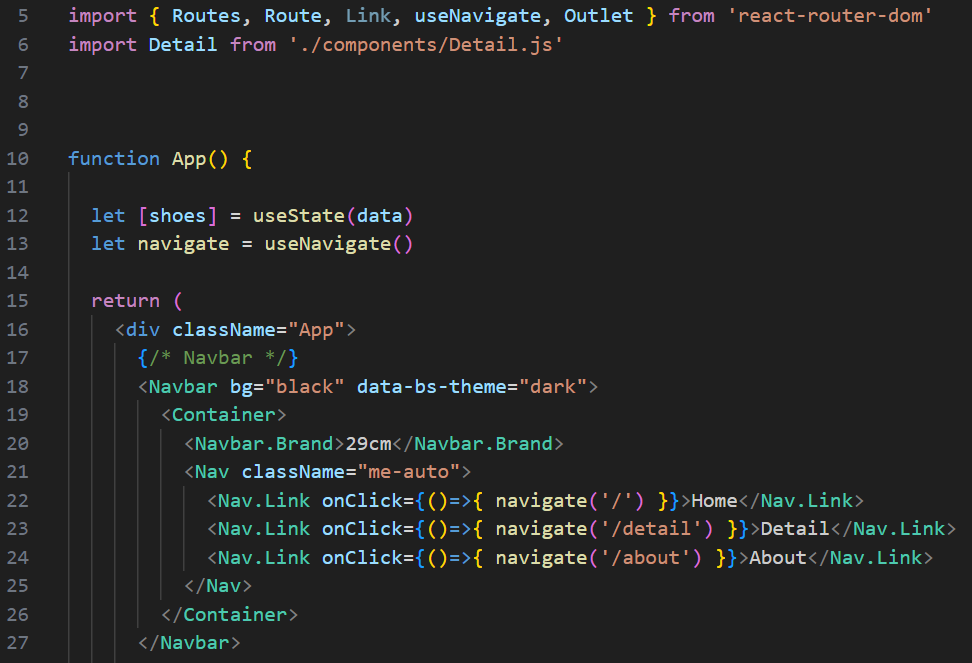
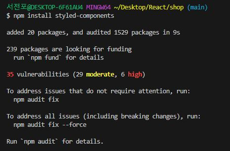
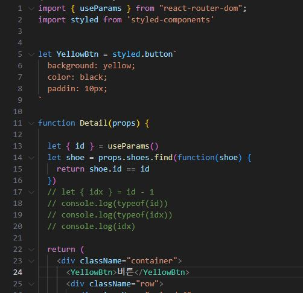
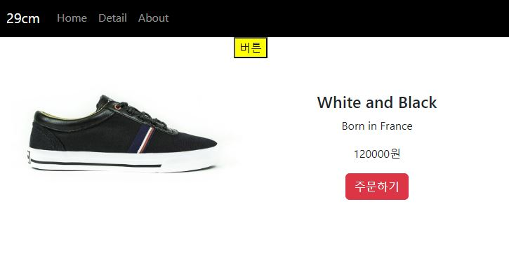
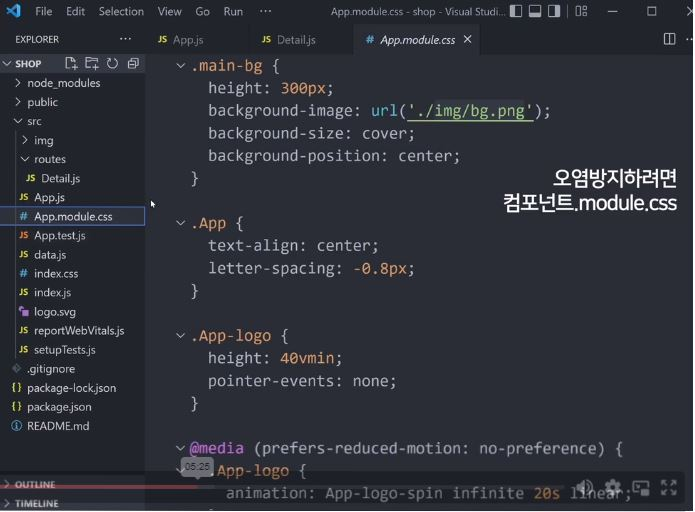

# React
for React Practice

## React-Router

1. 설치 코드  
  

2. index.js  
  

3. App.js  
  

4. 구현모습  
  

5. Link 구현  
    

6. useNavigate 구현  
   
 

## styled-components

### styled-components 장점 
- CSS 파일 안열어도 됨  
- 스타일이 다른 js 파일로 오염되지 않음  
- 페이지 로딩시간 단축  

### styled-components 구현

1. 설치 코드  
  

2. js 파일  
  

3. 구현모습  
  

4. js 파일에 CSS 파일 종속시키는 또다른 방법  
  

5. props를 활용한 구현  
  

