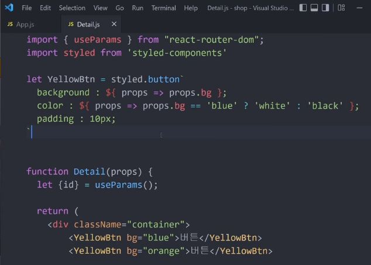

# React

## React-Router

1. 설치 코드  
   

2. index.js  
   

3. App.js  
   

4. 구현모습  
   

5. Link 구현  
   

6. useNavigate 구현  
   

<br />

## styled-components

### styled-components 장점

- CSS 파일 안열어도 됨
- 스타일이 다른 js 파일로 오염되지 않음
- 페이지 로딩시간 단축

### styled-components 구현

1. 설치 코드  
   

2. js 파일  
   

3. 구현모습  
   

4. js 파일에 CSS 파일 종속시키는 또다른 방법  
   

5. props를 활용한 구현  
   

<br />

## react-query

### react-query로 ajax 요청하는 법

#### 1. 설치 코드

```
npm install @tanstack/react-query
```

```javascript
//index.js

import { QueryClient, QueryClientProvider } from "react-query"; //1번
const queryClient = new QueryClient(); //2번

const root = ReactDOM.createRoot(document.getElementById("root"));
root.render(
  <QueryClientProvider client={queryClient}>
    <Provider store={store}>
      <BrowserRouter>
        <App />
      </BrowserRouter>
    </Provider>
  </QueryClientProvider>
);
```

#### 2. 실사용

import문

```javascript
import { useQuery } from "@tanstack/react-query";
```

useQuery문

```javascript
function App() {
  let result = useQuery("작명", () =>
    axios.get("https://codingapple1.github.io/userdata.json").then((a) => {
      return a.data;
    })
  );
}
```

### 장점1

AJAX 요청 성공/실패/로딩중 상태를 쉽게 파악할 수 있다

```javascript
function App() {
  let result = useQuery("작명", () =>
    axios.get("https://codingapple1.github.io/userdata.json").then((a) => {
      return a.data;
    })
  );

  return (
    <div>
      {result.isLoading && "로딩중"}
      {result.error && "에러남"}
      {result.data && result.data.name}
    </div>
  );
}
```

### 장점2

틈만나면 알아서 AJAX 재요청해준다.

(1) 페이지 체류하고나서 일정시간이 경과하거나,

(2) 다른 창으로 갔다가 다시 페이지로 돌아오거나,

(3) 다시 메인페이지로 돌아가거나

이런 여러 경우에 알아서 AJAX 요청을 다시 해줌.

※ 당연히 재요청 끄는 법, 재요청간격 조절하는 법도 있음.

```javascript
{
  staleTIme: 2000;
} // 재요청간격 2초로 설정
```

### 장점3

실패시 재시도 알아서 해줌

잠깐 인터넷이 끊겼거나 서버가 죽었거나 그러면 AJAX 요청이 실패함.

실패했을 때는 얘가 4번인가 5번인가 재시도를 알아서 해줌.

### 장점4

AJAX로 가져온 결과는 state 공유 필요없음

(1) 지금 App 컴포넌트에서 유저이름 가져오는 AJAX 요청을 날리고 있는데...

(2) 그 유저이름 결과가 Detail 컴포넌트에도 필요하면 어쩌지?

🙋‍♂️ 유저이름을 props 전송하면 됩니다!

🙅‍♀️ 근데 실은 props 전송 필요없습니다. Detail 컴포넌트에다가 유저이름 AJAX 요청하는 코드 똑같이 또 적으면 됩니다.

👨‍🔬 react-query는 스마트하기 때문에 AJAX 요청이 2개나 있으면 1개만 날려주고,

**캐싱기능**이 있기 때문에 이미 같은 AJAX 요청을 한 적이 있으면 그걸 우선 가져와서 쓰기 때문.

react-query가 주장하는 장점은

server-state (DB 데이터)를 프론트엔드에서 실시간 동기화해주는걸 도와준다고 함.

근데 AJAX 요청을 몇초마다 계속 날려서 가져오는 방식이라 좀 비효율적일 수도 있음.

실시간으로 서버에서 데이터를 자주 보내려면 웹소켓이나 Server-sent events 같은 가벼운 방식들도 있다.

그래서 react-query는 AJAX 관련 기능개발 편하게 할 수 있는데에 의의가 더 있다.

### RTK Query 라이브러리

Redux Toolkit 설치한 경우 RTK Query 라는것도 기본적으로 사용가능한데 비슷한 기능들을 제공한다. (다만 셋팅하는 코드가 좀 더러움...)

RTK Query는 실은 다른 용도로도 많이 쓰는데 AJAX 요청후 Redux state 변경을 하고 싶다면...

원래 Redux state 변경함수 안에선 AJAX 요청하면 안되어서 컴포넌트 안에서 해야한다.

근데 AJAX 요청하는 코드가 다양하고 많으면 컴포넌트 안의 코드가 길어지고 관리도 귀찮은데 그런걸 Slice 안에서 관리가능하게 도와준다.

그리고 AJAX 요청하는 코드가 100만개 있으면 그걸 편리하게 관리할 수 있게 도와준다.

(근데 코드가 약간 더러울 뿐...)
