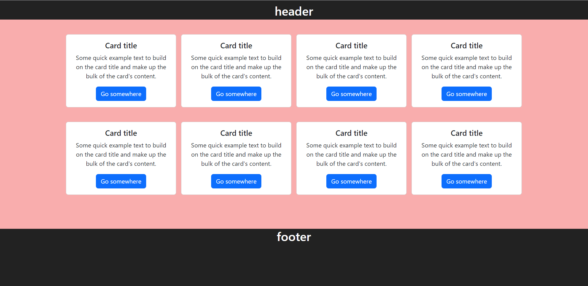
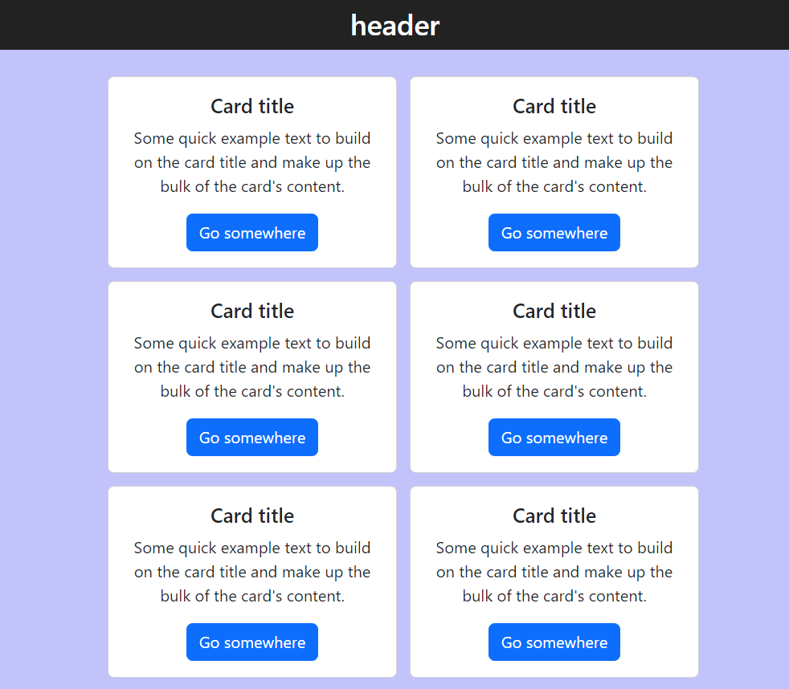
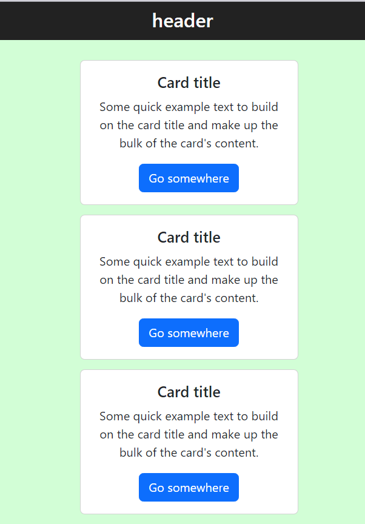

## 결과물

### Desktop


### Tablet


### mobile


<br />

## 구현 코드

### App.jsx

```javascript
import "./App.css";

function App() {
  return (
    <div className="App">
      <header>
        <h2>header</h2>
      </header>
      <div id="wrap">
        {Array(8)
          .fill()
          .map((_, idx) => (
            <div key={idx} className="card">
              <div className="card-body">
                <h5 className="card-title">Card title</h5>
                <p className="card-text">
                  Some quick example text to build on the card title and make up
                  the bulk of the card's content.
                </p>
                <a href="/" className="btn btn-primary">
                  Go somewhere
                </a>
              </div>
            </div>
          ))}
      </div>
      <footer>
        <h2>footer</h2>
      </footer>
    </div>
  );
}

export default App;
```

### App.css

```css
.App {
  width: 100vw;
  min-height: 100vh;
  height: fit-content;
  text-align: center;
}

header {
  position: fixed;
  top: 0;
  width: 100%;
  height: 50px;
  background-color: #222;
  color: #fff;
  padding: 8px;
  z-index: 999;
}

footer {
  position: relative;
  bottom: 0;
  width: 100%;
  height: 150px;
  background-color: #222;
  color: #fff;
}

#wrap {
  display: flex;
  flex-wrap: wrap;
  align-items: center;
  justify-content: center;
  min-height: calc(100vh - 150px);
  padding: 70px 24px;
}

.card {
  width: 18rem;
  height: fit-content;
  margin: 0.4rem;
}

@media screen and (min-width: 993px) {
  .App {
    background-color: rgb(249, 173, 173);
  }
  .mobile {
    display: none;
  }
  .tablet {
    display: none;
  }
}

@media (min-width: 577px) and (max-width: 992px) {
  .App {
    background-color: rgb(195, 195, 252);
  }
  .mobile {
    display: none;
  }
  .desktop {
    display: none;
  }
}

@media screen and (max-width: 576px) {
  .App {
    background-color: rgb(210, 254, 214);
  }
  .tablet {
    display: none;
  }
  .desktop {
    display: none;
  }
}
```
