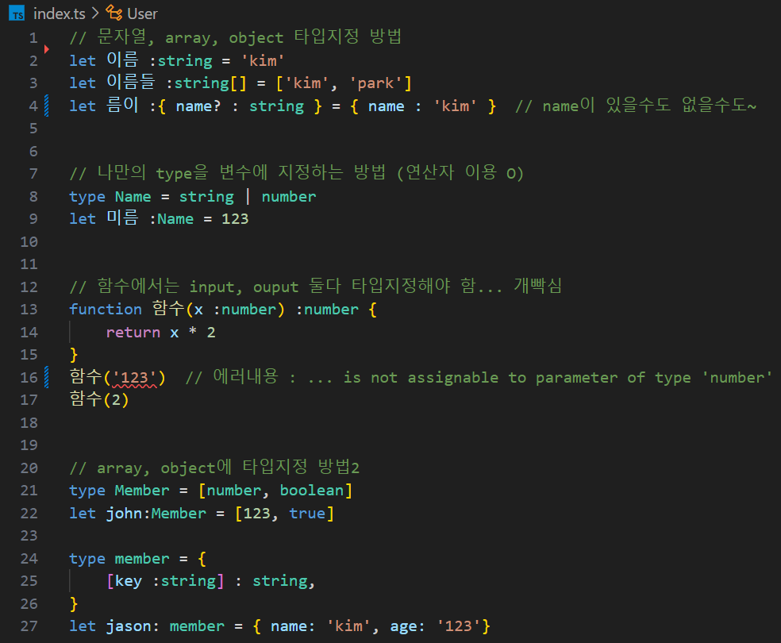
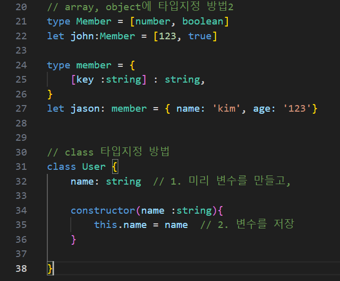
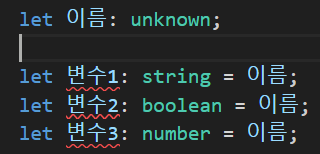
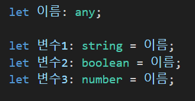

## 1. Type 지정 방법
  
  
<br>


## 2. 타입을 미리 정하기 애매할 때 (union type, any, unknown)

### union 타입
타입 2개 이상 합친 새로운 타입 만들기
```typescript
let 변수1 :number | string  = 123
변수1 = 'kim'   // let 변수1: string | number
변수1           // let 변수1: string

let 어레이 :(number | string)[] = [1, '2', 3];
let 오브젝트 :{a: string | string} = { a: '123'}
```

### any 타입
모든 자료형 허용해줌  
```typescript
let 애니 :any  // (타입실드 해제문법임... JS 변수처럼 만들어줌)
```

### unknown 타입
모든 자료형 허용해줌  
``` typescript
// any보다 안전함!!
let 언노운 :unknown
언노운 = 123
언노운 = {}
```

### unkwown이 any 보다 안전함
 
 

같은 코드이지만 unknown에서는 오류 발생.  

#### 이유 : 
1. unknown에서는 변수에 값를 할당해 줘도 여전히 변수의 타입은 'unknown'임.  
2. 반면에, any에서는 변수에 값을 할당해주면 변수의 타입이 그 값의 타입으로 바뀜.  

#### 결론 : 
아직 뭘 집어넣을지 모르겠는데 약간의 안정성을 도모하고 싶으면 unknown 타입을 사용. (실은 코드짜다가 any, unknown 부여할 경우는 별로 없음 ㅋㅋㅋ)  
<br>


## 3. 함수에 타입 지정하는 법 & void 타입

### 함수에 타입 지정하는 법
함수는 총 두 군데 타입지정이 가능함  
1. 함수로 들어오는 자료(파라미터)  
2. 함수에서 나가는 자료 (return)  
```typescript
function 함수(x :number) :number { 
return x * 2 
} 
```

### void 타입 사용하는 법
void는 '아무것도 없이 공허함'을 뜻하는 타입인데  
return할 자료가 없는 함수의 타입으로 사용 가능함  
```typescript
function 함수(x :number) :void { 
  return x * 2  //여기서 에러남 
} 
```

### 파라미터가 옵션일 경우
파라미터 우측에 물음표 붙이면 됨.
```typescript
function 내함수(x? :number) { 

}
내함수();   //가능
내함수(2);  //가능
```
근데 **'물음표'는 실은 'x : number | undefined' 이거랑 똑같은 의미**이다 (중요!!)

<hr/>

#### 문제1
```typescript
function 자기소개(name? :string) :void {
  if (name) {
    console.log('안녕하세요' + name)
  } else {
    console.log('이름이 없습니다.')
  }
}
```

#### 문제2
```typescript
function 문자열갯수(x :string | number) :number {
  return x.toString().length  // 입력된 숫자열 또는 문자열의 길이 
}
```

#### 문제3
```typescript
function 결혼가능(월소득 :number, 집보유 :boolean, 매력점수 :string) :string|void{
  let res :number = 0
  res += 월소득
  if (집보유){ 
    res += 500 
  }
  if (매력점수 === '상'){ 
    res += 100
  }
  if (res >= 600){
    return '결혼가능'
  }
}

console.log(결혼가능(100,true,'상'))
```

